# Learn & Do: Google Anthos on Hyperflex: What is all the Buzz About?

### THIS IS A SHARED ENVIRONMENT.  IN ORDER TO MAXIMIZE THE NUMBER OF USERS YOU WILL BE SHARING PODS

Table of Contents
=================
* [Credentials](#credentials)
* [Preparation](#preparation)
	* [Logging In](#logging-in)
* [Connect to SSH Host](#connect-to-ssh-host)
* [Deploy HX CSI](#deploy-hx-csi)

## Credentials

| VPN Uname | SSH Host     | SSH Uname |         GCP Uname.       |  Password   |
|-----------|--------------|-----------|--------------------------|-------------|
| demo1     | 10.139.14.21 | root      | user1@threepings.com     | C1sco12345! |
| demo2     | 10.139.14.22 | root      | user2@threepings.com     | C1sco12345! |
| demo3     | 10.139.14.23 | root      | user3@threepings.com     | C1sco12345! |
| demo4     | 10.139.14.24 | root      | user4@threepings.com     | C1sco12345! |
| demo5     | 10.139.14.25 | root      | user5@threepings.com     | C1sco12345! |
| demo6     | 10.139.14.26 | root      | user6@threepings.com     | C1sco12345! |
| demo7     | 10.139.14.27 | root      | user7@threepings.com     | C1sco12345! |
| demo8     | 10.139.14.28 | root      | user8@threepings.com     | C1sco12345! |
| demo9     | 10.139.14.29 | root      | user9@threepings.com     | C1sco12345! |
| demo10    | 10.139.14.30 | root      | user10@threepings.com    | C1sco12345! |
| demo11    | 10.139.14.31 | root      | user11@threepings.com    | C1sco12345! |
| demo12    | 10.139.14.32 | root      | user12@threepings.com    | C1sco12345! |
| demo13    | 10.139.14.33 | root      | user13@threepings.com    | C1sco12345! |
| demo14    | 10.139.14.34 | root      | user14@threepings.com    | C1sco12345! |
| demo15    | 10.139.14.35 | root      | user15@threepings.com    | C1sco12345! |
| demo16    | 10.139.14.36 | root      | user16@threepings.com    | C1sco12345! |
| demo17    | 10.139.14.37 | root      | user17@threepings.com    | C1sco12345! |
| demo18    | 10.139.14.38 | root      | user18@threepings.com    | C1sco12345! |
| demo19    | 10.139.14.39 | root      | user19@threepings.com    | C1sco12345! |
| demo20    | 10.139.14.40 | root      | user20@threepings.com    | C1sco12345! |
| demo21    | 10.139.14.41 | root      | user21@threepings.com    | C1sco12345! |
| demo22    | 10.139.14.42 | root      | user22@threepings.com    | C1sco12345! |
| demo23    | 10.139.14.43 | root      | user23@threepings.com    | C1sco12345! |
| demo24    | 10.139.14.44 | root      | user24@threepings.com    | C1sco12345! |
| demo25    | 10.139.14.45 | root      | user25@threepings.com    | C1sco12345! |

## Preparation

The lab leverages a Cisco Field Lab in the DMZ.  We will leverage the Cisco Anyconnect Client to access this lab.

## Logging In

* Open your Cisco Anyconnect Client
	* Connect to vpn.reqdemo.com 
	* Select "reqlab-admin" as the Group
	(your vpn may drop and reconnect after 1 minute.  This is normal)
	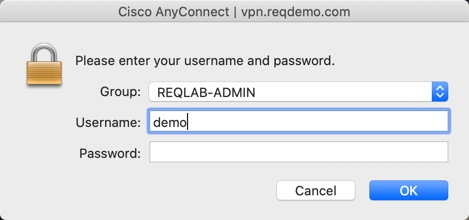
	
	
* For MAC users running Catalina.  Mac Security Policies have been enhanced.  See below:
https://support.apple.com/en-us/HT210176

* To work around this please do the following:

```
cd /opt/cisco/AnyConnect
sudo nano AnyConnectLocalPolicy.xml
```

* Edit ExcludeMacNativeCertStore to "true"

```
<ExcludeMacNativeCertStore>true</ExcludeMacNativeCertStore>
```

^X  (control X to exit)
press Y to indicate that you want to save
press enter to accept the existing name

Quit anyconnect and re-launch

## Connect to SSH Host
* ssh to the IP Address you were provided
	* Use the user [credentials](!credentials) you were provided.

## Connect to Google Cloud Console
* Open a web browser and browse to https://console.cloud.google.com/
	* Use the [credentials](!credentials) above.
	* You MAY see a screen prompt you for a phone number.  Please enter you cell phone number.  When the text comes to your cell phone, enter it.	
	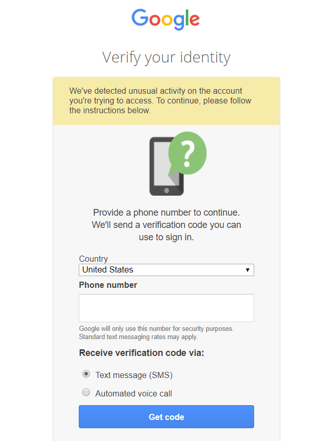
	
* In the upper left verify the project is "barksdalelabs".
	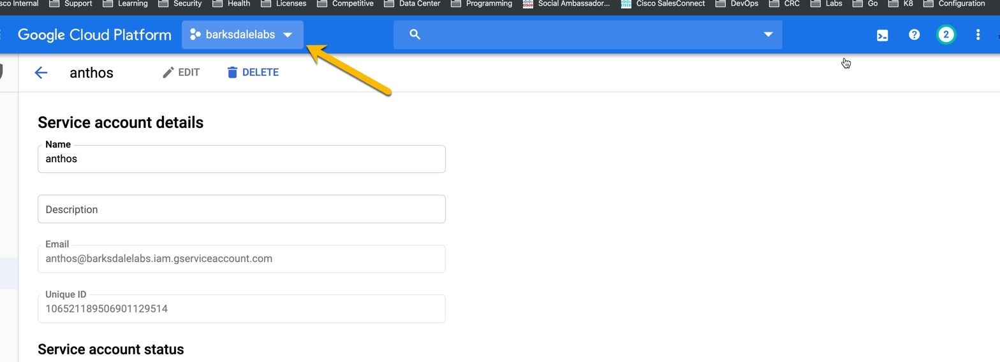
	
* If it is not:
	* Select the dropdown
	* Select "threepings" as the Organization
	* Select "barksdalelabs" as the project.
	* Click "Open"
	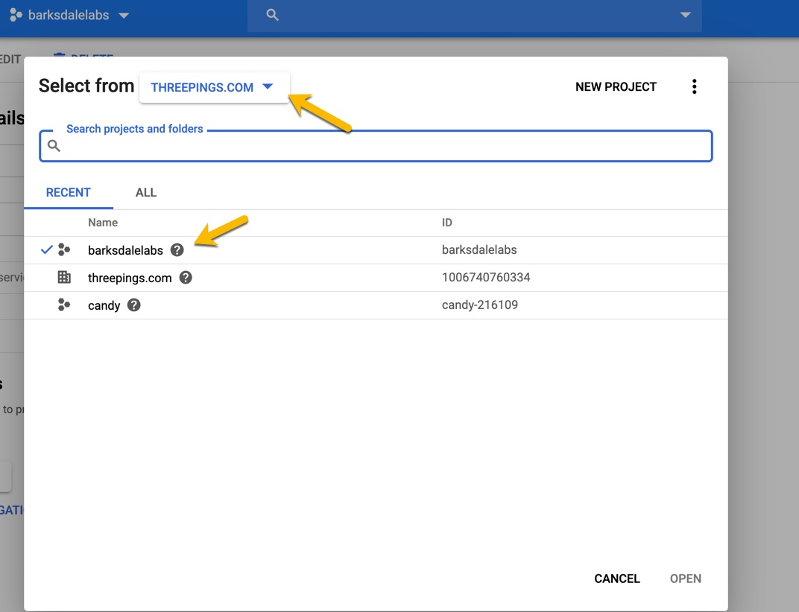
	
* Click the 3 lines in the upper left to expand the menu.
	* Hover over "Kubernetes Engine"
	* Select "Clusters"
	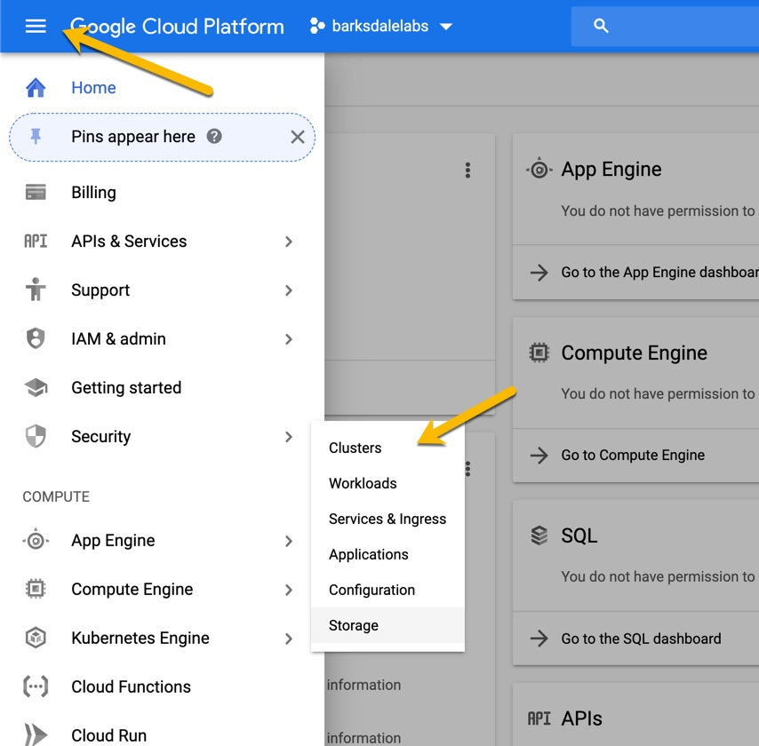


## Log Cluster in to GCP

* After the user cluster has been deployed it is automatically registered to GCP.  This can be seen in the dashboard by navigating to "Clusters" under "Kubernetes Engine".

* We need to login from our dashboard to that cluster that is on-prem.
	* Do the following:
		* From your SSH Host
			
			```
			mkdir <:wq
			username>
			cd <name of user>
			ls -l
			export KUBECONFIG=~/<SUBSTITUTE USER CLUSTER FILE NAME>
			```
	* The Example above shows the "user cluster file name" as "user1-kubeconfig"
	* The command for this example would be:
		
		```
		export KUBECONFIG=~/user1-kubeconfig
		```
		
	* This sets the KUBECONFIG Environment Variable

		```
		export KSA_NAME=gke-connect-admin
		kubectl create serviceaccount $KSA_NAME
		kubectl create clusterrolebinding $KSA_NAME --clusterrole cluster-admin - serviceaccount=default:$KSA_NAME
		TOKEN_SECRET=`kubectl get serviceaccounts $KSA_NAME -o yaml | \ grep $KSA_NAME-token | awk -F": " '{print $2}'`
		echo `kubectl get secret $TOKEN_SECRET -o yaml | grep "token:" | awk -F": " '{print $2}' | base64 -d`
		```
			
		* Copy the token that is presented back.
	
		
## Deploy HX CSI

* On your SSH Host
	* Set the kubeconfig file for the 

## Deploy Persistant Volume App

* Apply the Persistant Volume Claim

	```
	kubectl apply -f 01-message-board-pvc.yaml
	kubectl get pvc
	```

* Apply the Message Board yaml file

	```
	kubectl apply -f 02-message-board.yaml
	```

	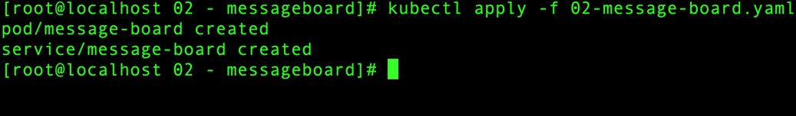

* Get the Service IP

	```
	kubectl get svc
	```

	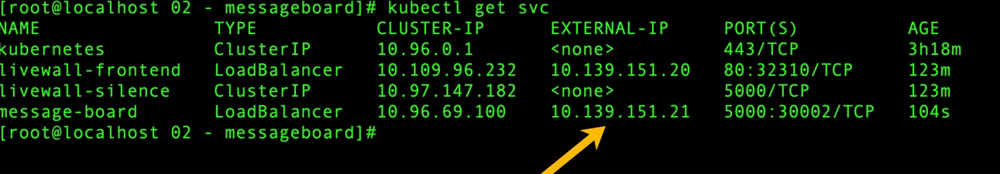

* Notice the Port Number

* Web to the IP on port 80

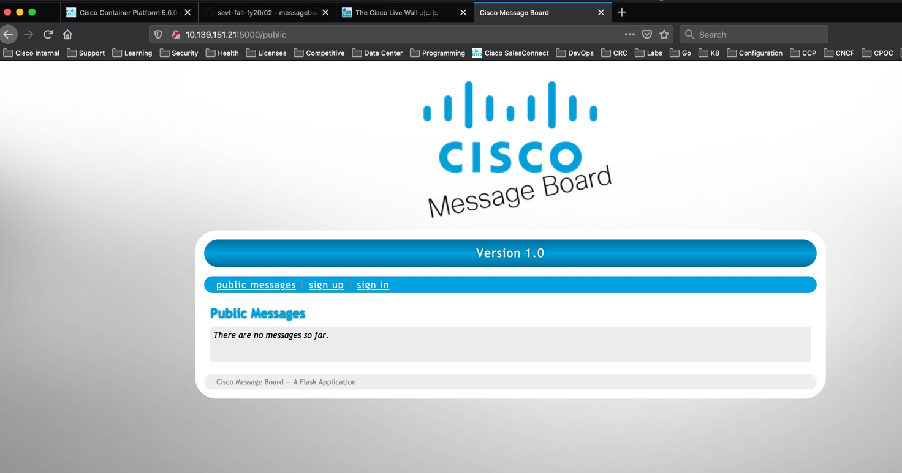

* Select "Signup"
* Provide the requested info (this is dummiy info for demo purposes only)

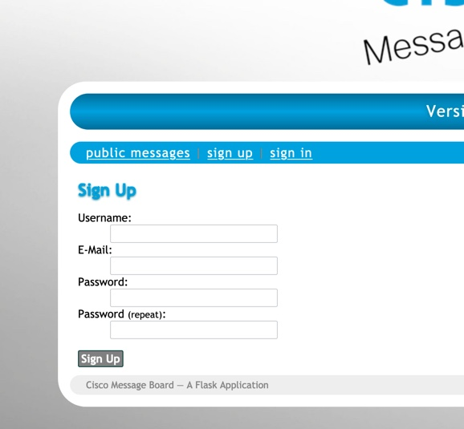

* Sign in using the credentials you provided


* Create a few messages to fill in the database.

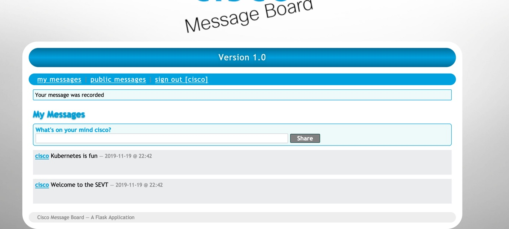

* Apply the new version of the messageboard

	```
	./06-changeimage.sh 
	```

* What happened?

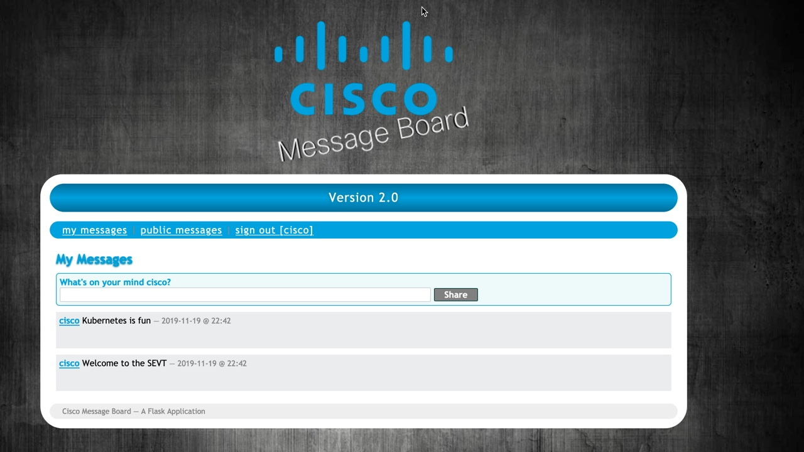

* Notice the messages stayed.
* Why?

## Lab Cleanup

* Please run the following commands to clean up your pod for the next session

	```
	kubectl delete -f 05-mb-pod.yaml
	kubectl delete -f 04-mb-pvc.yaml
	kubectl delete -f 03-nginx-svc.yaml
	```
	
* In your GCP Dashboard do the following:
	* 


